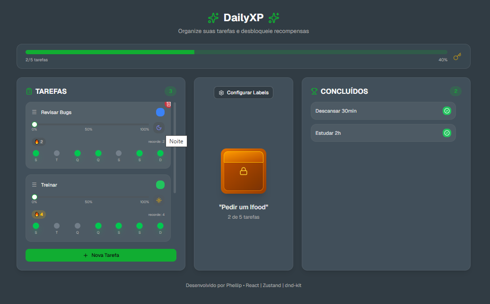
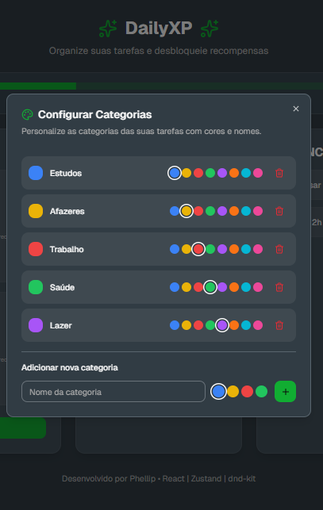

# DailyXP

Aplicação web de produtividade com sistema de tarefas gamificado, incluindo progresso visual e streak inspirado no Duolingo.

## Demo

https://routine-app-kx96.vercel.app/

---

## Funcionalidades

* Criação, edição e exclusão de tarefas
* Sistema de progresso (0%, 50%, 100%)
* Streak semanal com feedback visual
* Opção de desfazer tarefas concluídas
* Organização por categorias
* Interface responsiva (mobile e desktop)

---

## Tecnologias

* React / Next.js
* TypeScript
* Zustand (gerenciamento de estado)
* Tailwind CSS
* Vercel (deploy)

---

## Aprendizados

Neste projeto foram aplicados conceitos como:

* Gerenciamento de estado global com Zustand
* Lógica de negócio para controle de tarefas e streak
* Construção de interfaces interativas
* Aplicação de boas práticas de UX
* Deploy de aplicações web

---

## Decisões técnicas

- Zustand para gerenciamento de estado global simples e performático
- Persist middleware para salvar dados no localStorage
- Interface focada em produtividade e feedback visual (streak, progresso)
- Estrutura inicial gerada com v0.dev e posteriormente adaptada manualmente

---

## Preview




---

## Como rodar localmente

```bash
git clone https://github.com/Phel-lip/routine-app.git
cd routine-app
pnpm install
pnpm dev
```

---

## Sobre

Projeto desenvolvido com foco em prática de desenvolvimento front-end, organização de estado e criação de uma experiência gamificada de produtividade.

---

## Autor

Phellip  
[GitHub](https://github.com/Phel-lip)
